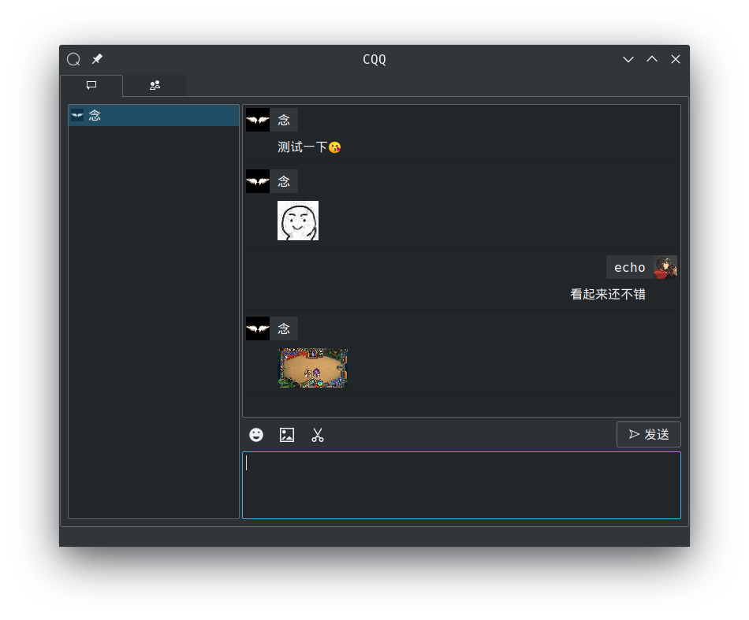
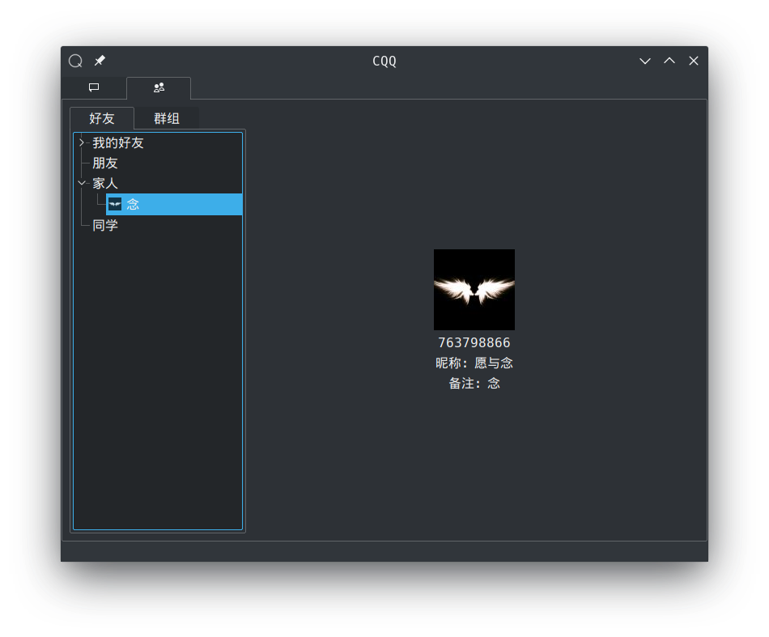

# CQQ
CQQ即CoolQ + Qt + QQ，通过[CoolQ HTTP API 插件](https://github.com/richardchien/coolq-http-api)的WebSocket接口进行通信，使用Qt的C++绑定编写的QQ客户端。

## 测试环境
* 服务器：
  * CoolQ Docker([richardchien/cqhttp](https://cqhttp.cc/docs/4.8/#/Docker))
  * CoolQ Pro 5.13.1(190303)
  * richardchien/coolq-http-api 4.8.0
* 本地开发环境：
  * Qt Creator 4.8.2 Based on Qt 5.12.1 (GCC 8.2.1 20181127, 64 bit)

## 已实现
* [x] 获取好友列表，群组列表
* [x] 接收多种格式消息
* [x] 发送文本消息
* [x] 发送图片
* [x] 聊天图片预览
* [x] 聊天消息框自动滚动
* [x] 记录窗口大小调整
* [x] 菜单选项：重置窗口布局，清空缓存，修改配置，刷新头像
* [x] 深浅色不同主题下调整颜色
* [x] 清空聊天对象的聊天消息
* [x] 下载完毕头像后刷新联系人列表
* [x] 消息显示时间戳
* [x] 自动滚动优化，当窗口最小化时不自动滚动
* [x] 匹配文本消息中的链接
* [x] 细节优化：为鼠标指向图片显示预览增加偏移，防止滚动消息时鼠标碰到图片而停下，同时根据屏幕左右剩余宽度确定预览图放置位置
* [x] 细节优化：增加滚动到底部按钮

## 希望实现

* [ ] 消息部分加载
* [ ] 撤回消息
* [ ] at 群组成员
* [ ] 新消息提醒
* [ ] 托盘图标
* [ ] 重试机制修改
* [ ] 加入 QQ face
* [ ] 表情选择框性能优化
* [ ] 细节优化：自动清理下载图片失败后遗留的空文件

## 说明
* Websocket需要使用心跳来维持连接，wsEVENT接口由服务端发送[心跳事件](https://cqhttp.cc/docs/4.8/#/Post?id=%E5%BF%83%E8%B7%B3)，wsAPI接口由客户端每15s（模仿服务端心跳间隔）发送一次`get_status`请求。
* ~~与单个聊天对象的聊天信息过多时，自动滚动会无法滚动到最底部，程序中的具体表现是`QTextBrowser`调用`setHtml()`后立即获取`verticalScrollBar()->maximum()`，得到的最大值不正确。推测可能是`QTextBrowser`渲染需要时间，渲染结束后才可以获得正确的值。~~ 已使用`scrollToAnchor()`方法避免。
* CoolQ HTTP API推送的消息中少数CQ码的图片url无法打开，表现为下载失败，手动复制链接出来访问时显示404，~~推测与CoolQ HTTP API缓存有关，需要进一步验证。~~ 未发现明显原因。
* 离线消息由于CoolQ HTTP API的接口限制，可能需要特殊方法实现。
* 发送图片时存在大小限制，需要进一步测试。
* 插入emoji表情时的表格存在性能问题，拉伸选择emoji窗口时比较明显，需要换用其它方式进行选择。
* 截图功能未实现，当前的截图按钮是发送剪切版中的文件名对应的图片，可以识别类似`/home/nian/test.png`或者`file:///home/nian/test.png`格式的路径。可以在系统默认截图工具中设置保存图片后复制路径到剪切版，搭配系统截图工具实现发送截图功能。
* 图片预览需要放大，缩小，拖动，旋转功能，当前程序中调用系统默认图片查看器打开图片文件。
* Qt的QNetworkAccessManager首次下载任务报`QNetworkReplyHttpImplPrivate::_q_startOperation was called more than once`，需要解决。

## 截图

